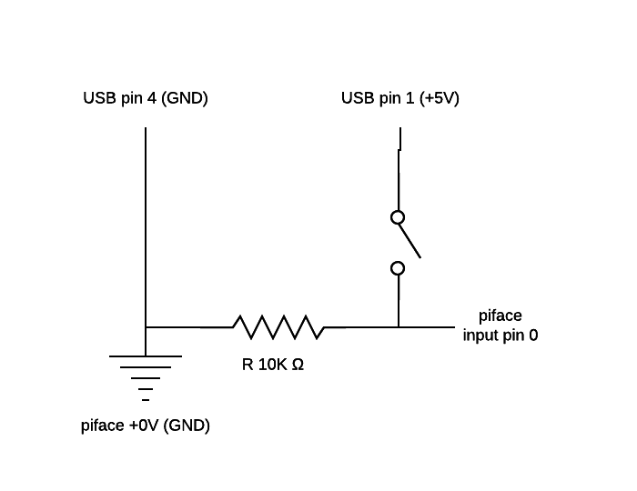

# rpi-piface-tvlift

This script is for controlling a Venset TV-lift using power from an USB-port as trigger. Add a pulldown resistor between inputpin and common/ground/0V. It relies on an correctly installed piface digital: http://www.piface.org.uk 

